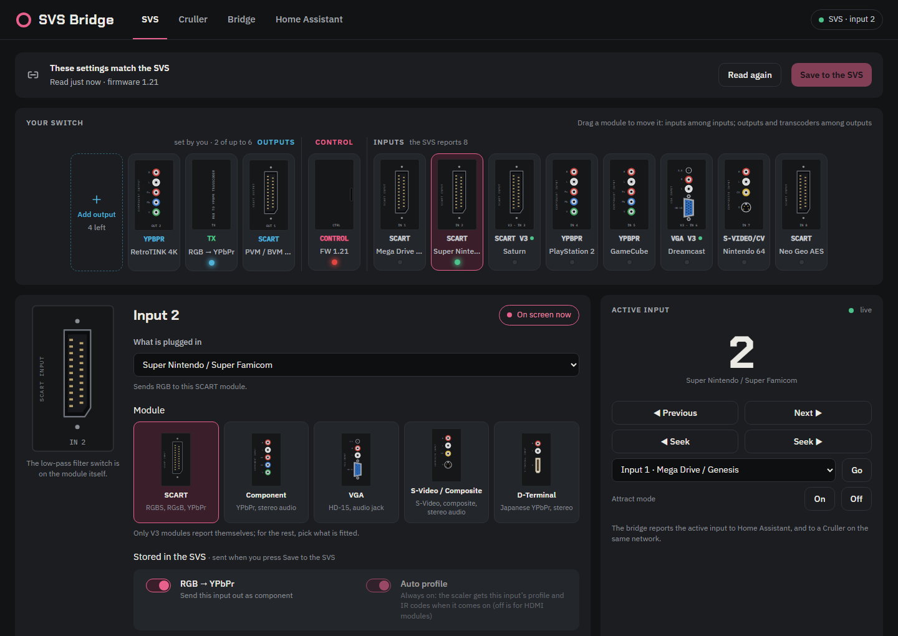
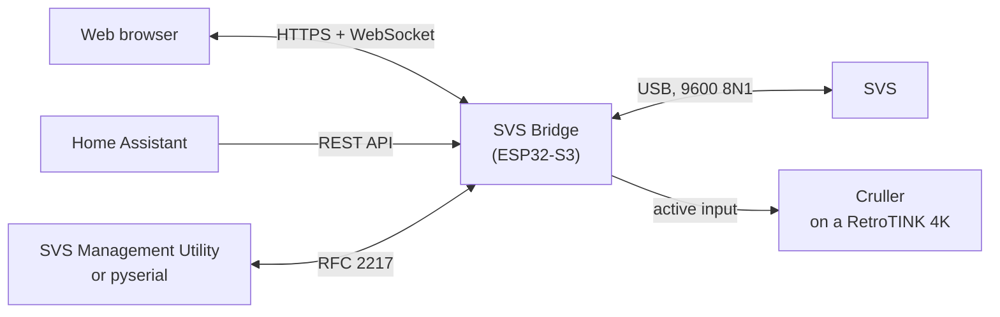
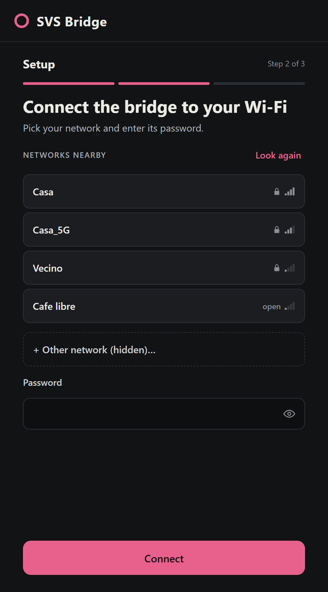
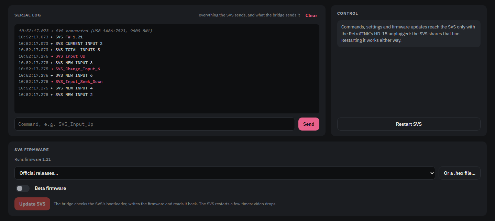
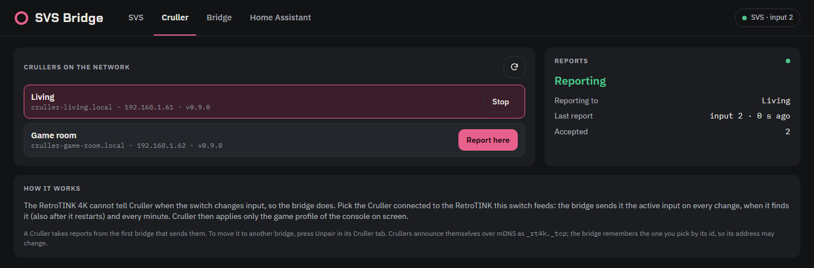
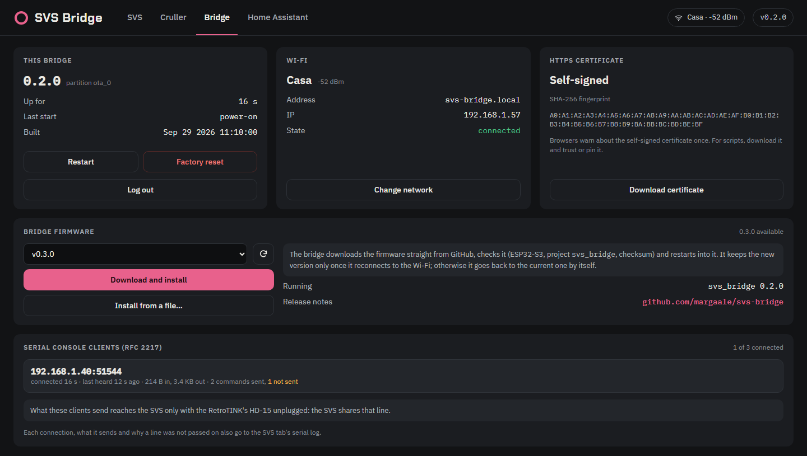

<div align="center">

# SVS Bridge

**Put your [SVS (Scalable Video Switch)](https://scalablevideoswitch.com/) on your network.**<br>
See and switch inputs, change its settings and update its firmware from any browser,
and let Home Assistant and your RetroTINK 4K know what's on screen.

[](https://github.com/margaale/svs-bridge/actions/workflows/build.yml)
[](https://github.com/margaale/svs-bridge/releases/latest)
[](https://github.com/espressif/esp-idf)
[](LICENSE)

</div>

SVS Bridge is firmware for an ESP32-S3 board that plugs into the SVS's USB-C port, where
you would otherwise connect a PC running the SVS Management Utility. It talks to the SVS over
USB and serves a web UI over WiFi, so the switch can live behind the TV and still be managed
from your phone.



## Features

- **Live status**: the input on screen and everything the SVS says, pushed to the page as it
  happens.
- **Input controls**: Previous and Next, Seek (the next input that has a signal), go to any
  input, attract mode on or off.
- **Your switch, drawn**: the outputs, control module and inputs as they sit. Pick each module
  and the console or display on it, and drag modules to match your stack. V3 modules and
  transcoders are detected.
- **SVS settings without a PC**: per input, RGB ↔ YPbPr transcoding, sync on green, sync
  bypass, auto profile and the IR codes sent to the scaler, with the official presets for the
  RetroTINK 4K, 5X and OSSC. Read, edit, save; every byte is read back.
- **SVS firmware updates over WiFi**: official releases straight from the
  [official firmware repository](https://github.com/Arthrimus/SVS_Firmware_Repository)
  (betas if you want them) or your own `.hex`. The bootloader is checked first, and the new
  firmware is read back after.
- **RetroTINK 4K game profiles**: the bridge tells [Cruller](https://github.com/margaale/Cruller)
  which console is on screen, so the RetroTINK 4K loads its profile.
- **Home Assistant**: a local, discoverable, token-protected API, with a
  [HACS integration](https://github.com/margaale/svs-bridge-hacs). No cloud, no MQTT.
- **The official utility, remotely**: the SVS's serial port is also on the network
  (RFC 2217), for the SVS Management Utility or pyserial.
- **Updates itself safely**: over the air from GitHub or from a file. If the new firmware
  cannot get back on WiFi, the bridge rolls back by itself.
- **Secure by default**: HTTPS with a key generated on the device, an admin password, and a
  separate token for the API.

## How it fits together



Everything on the left reaches the bridge over your WiFi, and Cruller is on the same network.
The bridge is a USB host on the ESP32-S3's native USB port and talks to the SVS's CH340 at
9600 8N1, the same link the official utility uses
([serial command reference](https://arthrimus.github.io/SVS_Firmware_Repository/serial.html)).

## What you need

- **An SVS.** Reading and saving its settings needs SVS firmware 1.20 or newer; Previous, Next
  and Go need 1.12, and Seek and attract mode need 1.14. The bridge can update the SVS for you.
- **An ESP32-S3 N16R8 board** (16 MB flash, 8 MB PSRAM) with two USB ports, usually labelled
  `COM` (USB-to-UART) and `USB` (native USB), and a `USB-OTG` solder jumper.
- **A 5 V / 3 A power supply** for the board's `5V` pin.
- **A USB-C cable** from the board's `USB` port to the SVS.
- Optional: [Home Assistant](https://www.home-assistant.io/), and a
  [Cruller](https://github.com/margaale/Cruller) on a RetroTINK 4K.

## Hardware setup

| Board port | Connects to |
|---|---|
| `COM` (USB-to-UART) | Your PC, to flash the bridge the first time and read its log |
| `USB` (native, GPIO19/20) | The SVS's USB-C port. The bridge is the USB host |

> [!WARNING]
> The SVS draws up to 1.5 A from its USB-C port. Power the board from a 5 V / 3 A supply on
> the `5V` pin, and bridge the `USB-OTG` solder jumper so the native `USB` port outputs 5 V to
> the SVS. Do **not** bridge `IN-OUT`: its diode keeps the supply from back-feeding the PC on
> the `COM` port.

## Installation

### 1. Flash the bridge

You only do this once over a cable. Later updates happen over the air.

1. Download `svs-bridge-<version>-esp32s3_n16r8-svs_bridge-factory.bin` from the
   [latest release](https://github.com/margaale/svs-bridge/releases/latest).
2. Connect the board's `COM` port to your computer.
3. Flash it at offset `0x0`, either from the browser with Espressif's
   [ESP Tool](https://espressif.github.io/esptool-js/) (Chrome or Edge) or with
   [esptool](https://github.com/espressif/esptool):

   ```bash
   pip install esptool
   ```

   ```bash
   python -m esptool --chip esp32s3 --port COM3 write_flash 0x0 svs-bridge-0.2.0-esp32s3_n16r8-svs_bridge-factory.bin
   ```

   Use your own serial port (`COM3` on Windows, `/dev/ttyUSB0` on Linux,
   `/dev/cu.usbserial-*` on macOS) and the file you downloaded. If esptool cannot connect,
   hold **BOOT**, press **RST**, and release **BOOT**.

### 2. Put it on your WiFi



1. Power the bridge. With no WiFi configured, it creates the open network `SVS-Bridge-XXXX`.
2. Join that network from a phone or laptop. The setup page opens by itself (otherwise, browse
   to `http://192.168.4.1`).
3. Create the admin password (at least 8 characters). You'll use it to log in.
4. Pick your network and enter its password. Once the bridge joins it, the setup network
   closes and your phone goes back to its usual network.
5. From your home network, open **`https://svs-bridge.local`** and log in. Your browser warns
   about the bridge's self-signed certificate once: accept it (see [Security](#security)).

If the bridge cannot reach your network for 15 s (wrong password, router off, new house), the
setup network comes back while it keeps retrying. Changing the network from there asks for the
admin password.

<br clear="right">

### 3. Connect the SVS

Plug the SVS into the board's `USB` port. The badge in the top right of the web UI turns green
and shows the input on screen.

## Using it

> [!IMPORTANT]
> **Sending anything to the SVS needs the RetroTINK's HD-15 cable unplugged.** The SVS shares
> a single UART between its USB port and the HD-15 link it uses to send serial commands to a
> RetroTINK. With the HD-15 connected, the bridge still hears everything (the input on screen,
> the firmware version), so status, Home Assistant and Cruller keep working. But input
> commands, settings and firmware updates don't reach the SVS. Unplug the HD-15 for those, then
> plug it back in. **Restart SVS** works either way. The SVS author confirmed this is how the
> hardware works.

### The SVS tab

This tab replaces the official SVS Management Utility for day-to-day use (see the screenshot at
the top of this page).

- **Your switch.** The SVS only counts its inputs and recognises V3 SCART/VGA modules and
  transcoders. Pick the other modules (SCART, Component, VGA, S-Video/Composite, D-Terminal),
  add your outputs (up to 6), and pick the console on each input and the scaler or display on
  each output. The list puts the consoles that fit the module first and warns when one doesn't
  send what the module takes. Drag modules to reorder them, or use Alt+←/→. A transcoder only
  converts the outputs past it, further from the control module. The layout is kept on the
  bridge.
- **Settings stored in the SVS**, per input: RGB → YPbPr and YPbPr → RGB transcoding, sync on
  green and sync bypass (V3 modules), auto profile, and the IR codes the SVS sends the scaler
  when the input comes on. Click **Read from the SVS**, change them, then **Save to the SVS**.
  Moving an input takes its settings with it.
- **Active input**: Previous, Next, Seek, Go to an input, and attract mode. A green light
  marks the input on screen; a blue one marks a transcoder that is converting it.
- **Serial log**: everything the SVS says and everything the bridge sends it. You can type raw
  [serial commands](https://arthrimus.github.io/SVS_Firmware_Repository/serial.html)
  such as `SVS_Input_Up`.

### Updating the SVS firmware



Under **SVS firmware**, pick an official release (turn on **Beta firmware** to list the betas
too) or load your own `.hex`, then press **Update SVS**. The bridge:

1. restarts the SVS into its bootloader and checks that it is one it can flash (urboot on an
   ATmega328P),
2. validates the whole image and checks that it fits,
3. writes it, reads everything back to compare, and waits for the SVS to report the new
   version.

Official releases are downloaded from the repository the official utility uses and checked
against the hash GitHub reports. The video drops while the SVS restarts. If the bootloader
does not answer, **Diagnose bootloader** retries with other timings and speeds and writes what
it finds to the serial log, without writing anything to the SVS.

### RetroTINK 4K game profiles with Cruller



[Cruller](https://github.com/margaale/Cruller) puts a RetroTINK 4K on the network, and its
gameID feature applies the game profile of the console on screen. The RetroTINK can't tell
when the switch changes input, so the bridge tells Cruller. In the **Cruller** tab, pick the
Cruller on the RetroTINK this switch feeds. The bridge then reports the active input and your
switch's layout on every change, and every minute in case a report was lost.

A Cruller pairs with the first bridge that reports to it. To move it to another bridge, press
**Unpair** in that Cruller's own Cruller tab.

### Home Assistant

Install the [SVS Bridge integration](https://github.com/margaale/svs-bridge-hacs) through
HACS. Home Assistant discovers the bridge on your network by itself (mDNS `_svsbridge._tcp`).
When you add it, paste the token from the bridge's **Home Assistant** tab. Automations can then
react to input changes: turn on the TV, switch a scaler profile, and so on.

The API is two read-only endpoints, both requiring an `Authorization: Bearer <token>` header:

| Endpoint | Returns |
|---|---|
| `GET /api/v1/info` | Device identity: id, name, model, firmware version |
| `GET /api/v1/state` | SVS state and bridge diagnostics |

```bash
curl -k -H "Authorization: Bearer $TOKEN" https://svs-bridge.local/api/v1/state
```

```json
{
  "svs": {
    "connected": true, "firmware": "SVS_FW_1.21", "current_input": 2, "total_inputs": 8,
    "live": true, "inputs_live": true, "send_enabled": true,
    "current_input_name": "Super Nintendo / Super Famicom", "current_input_device": "snes"
  },
  "bridge": { "sw_version": "0.2.0", "rssi": -52, "uptime_s": 3600 }
}
```

### The official SVS Management Utility over the network

The SVS's serial port is also an RFC 2217 server on TCP port 2217
(`rfc2217://svs-bridge.local:2217`). Up to 3 clients share it like a serial cable: each one gets
what the SVS says, byte for byte, and what it sends reaches the SVS (with the HD-15 unplugged).
Opening the port raises DTR, which restarts the SVS, just as it does over a cable.

To use the official utility from a PC, create a virtual COM port that forwards to
`svs-bridge.local:2217` and passes DTR through (for example, com0com with com2tcp), and pick
that port in the utility. Use the web UI, not the utility, for SVS firmware updates. The
**Bridge** tab lists the connected clients and their traffic.

### The Bridge tab



- **Bridge firmware**: pick a release and press **Download and install**, or use **Install
  from a file…** with an `svs_bridge.bin`. The image is checked (ESP32-S3, project
  `svs_bridge`, checksum) before the bridge switches to it. A new version is kept only once it
  reconnects to WiFi (within 5 minutes). If it crashes or never connects, the bridge goes back
  to the previous one, so a bad update can't leave a remote bridge unreachable.
- **WiFi**: the network, its signal, and a way to change it.
- **HTTPS certificate**: its fingerprint, and a download for scripts that want to pin it.
- **Restart**, **Factory reset** and **Log out**.

## Security

- **HTTPS everywhere.** On first boot, the bridge generates its own ECDSA P-256 key and a
  self-signed certificate for `svs-bridge.local`. The key never leaves the device and survives
  updates. Its SHA-256 fingerprint is shown in the web UI and printed on the serial console at
  boot. Plain HTTP (port 80) only serves the setup portal while the setup network is up;
  otherwise it redirects to HTTPS.
- **Admin password**, stored as a salted PBKDF2-HMAC-SHA256 hash. Repeated wrong passwords lock
  logins for a while. Sessions live in RAM, so a restart logs everyone out.
- **API token** for Home Assistant, separate from the password. Regenerating it revokes the
  old one.
- **Setup network**: open by default. It only offers setup, and once the admin password exists,
  it asks for it. To give it a WiFi password, set one under `menuconfig` → **SVS Bridge** →
  **Network**.
- **Not authenticated:** the RFC 2217 port (2217) accepts any client on your network, and
  reports to Cruller go over plain HTTP. Keep the bridge on a network you trust, and don't
  forward its ports to the internet.

## Factory reset

This erases all of the bridge's settings (WiFi, admin password, API token, certificate, switch
layout, chosen Cruller) and reboots into setup mode. The installed firmware stays, and so do the
settings stored in the SVS itself. Either:

- in the web UI, go to **Bridge** → **Factory reset**, or
- hold the **BOOT** button for 10 s while the bridge is running. The serial console announces
  the reset after 2 s, and releasing the button earlier cancels it.

This is also how you recover a forgotten admin password. Holding BOOT *while powering up* does
not reset anything: that enters the ESP32's download mode for flashing.

## Troubleshooting

- **`svs-bridge.local` doesn't open.** Some devices and networks don't resolve `.local` names.
  Use the bridge's IP address from your router instead.
- **Commands, settings or updates don't reach the SVS.** Unplug the RetroTINK's HD-15 (see
  [Using it](#using-it)).
- **"Reading the SVS's settings needs its firmware 1.20 or newer."** Update the SVS from the
  **SVS firmware** panel.
- **The bridge restarted on its old version after an update.** The new firmware didn't
  reconnect to WiFi in time, so the bridge rolled back. The Bridge tab says so after the
  restart.

## Building from source

This needs [ESP-IDF](https://docs.espressif.com/projects/esp-idf/) v6.x (developed with v6.1).
In a shell with ESP-IDF activated:

```bash
scripts/build.sh esp32
```

```bash
idf.py -C src/platform/esp32 -B build/esp32 -p COM3 flash monitor
```

The build goes to `build/esp32`, including `svs_bridge-factory.bin` to flash a new board at
`0x0`. Its `sdkconfig` is generated from `sdkconfig.defaults` once and then kept, so after
changing the defaults, delete `build/esp32/sdkconfig` (the build tells you where it matters).
Options live under `idf.py -C src/platform/esp32 -B build/esp32 menuconfig` → **SVS Bridge**:

| Menu | Options |
|---|---|
| SVS serial link | Baud rate, DTR on open, line ending, hex dump of received data |
| Network | Hostname (default `svs-bridge`), setup network password, WiFi power save |
| Firmware updates | How long a new firmware has to reconnect before it is rolled back (default 300 s) |
| Factory reset button | GPIO (default 0, the BOOT button) and hold time (default 10 s) |

A local build takes its version from `src/version.cmake`. CI passes its own version in
`SVS_BRIDGE_VERSION`.

## Development

### Web UI without a board

```bash
python scripts/dev_server.py
```

This serves the web UI on `http://localhost:8080/` (and the setup portal on `/portal`) with a
mocked device API: a simulated SVS that changes inputs, Crullers on the network, and firmware
updates that take a few seconds. The mock admin password is `password`. The screenshots in
this README come from it.

### Tests

The logic that must never break (the AVR reset-vector patch, the Intel HEX decoder, the SVS
line parser, the SVS settings map and the RFC 2217 parser) lives in dependency-free code in
`src/core`. It is unit-tested on the host, with no ESP-IDF or hardware:

```bash
tests/run.sh
```

### Source layout

```
src/core/             Pure logic, no ESP-IDF: svs_vectors.h, svs_hex.h, svs_protocol.h,
                      svs_config.h (the SVS's settings map), rfc2217_proto.c
src/platform/esp32/   The ESP32-S3 target, an ESP-IDF project; its code is in main/
src/web/              The web UI and the setup portal, embedded as C arrays at build time
tests/                Host unit tests of src/core
scripts/              build.sh, and dev_server.py for the web UI
```

The layout matches [Cruller](https://github.com/margaale/Cruller).

### Branches and releases

Work goes to `develop` (the default branch) through pull requests, and `master` takes what is
released. Versions come from GitVersion (`GitVersion.yml`) and
[CI](.github/workflows/build.yml):

- **`master`**: every push is a release, tagged `vX.Y.Z`; the only branch that is tagged. The
  patch number grows with each one; a line `+semver: minor` in a commit message bumps the minor.
- **`develop`**: every push is built as `X.Y.Z-alpha.N`, where N is CI's run number, so a
  newer build always has a newer version. Not published: the images are attached to the run.
- **Pull requests**: built as `X.Y.Z-pr.N`, the same.

Release images are named `svs-bridge-<version>-esp32s3_n16r8-<file>`: `svs_bridge.bin` is the
OTA image, `svs_bridge-factory.bin` flashes a new board at `0x0`, and the bootloader, partition
table and OTA data are included for flashing in parts. Each release also carries a plain
`svs_bridge.bin`, which is the name bridges on 0.1.x look for when updating from GitHub.

## Technical notes

<details>
<summary><b>SVS settings: the commands behind them</b></summary>

The settings use commands that the SVS's serial documentation doesn't list, taken from the
official utility. `R<addr>` reads a byte of the control module's EEPROM, `W<vvv><addr>` writes
one, and `Y<n>`/`G<n>` read the transcoders of input n. The EEPROM map is in
[`src/core/svs_config.h`](src/core/svs_config.h).

The bridge only writes bytes it has read and that changed, and reads each one back. To change a
transcoder, it switches to that input (as the utility does), then back to the one on screen.

</details>

<details>
<summary><b>SVS firmware flashing</b></summary>

The SVS runs an ATmega328P with an [urboot](https://github.com/stefanrueger/urboot)
bootloader. The official tool flashes it with `avrdude -c urclock`. The bridge speaks the same
[urclock protocol](https://github.com/stefanrueger/urboot/blob/main/urprotocol.md) from the
ESP32 ([`svs_flasher.h`](src/platform/esp32/main/svs_flasher.h)).

The SVS's bootloader is a *vector bootloader*: the application reaches it through the reset
vector, so every image must be patched to keep that vector pointing at the bootloader, as
avrdude does. Getting this wrong would brick the SVS. The bridge therefore confirms that its
patch matches what is already on the chip before writing, and writes the reset page first, so
an interrupted write can simply be retried.

</details>

<details>
<summary><b>Cruller report format</b></summary>

Crullers announce themselves over mDNS as `_rt4k._tcp` (TXT `id`, `ver`, `api`, and `name`
once named). The bridge stores the chosen Cruller's `id`, not its address, which it looks up
again each time. It sends the report over plain HTTP:

```
POST http://<host>:<port>/api/svs
Content-Type: application/json

{"id": "svs-bridge-aabbccddeeff", "current_input": 3, "total_inputs": 8, "live": true,
 "inputs": [{"kind": "scart", "name": "Super Nintendo / Super Famicom", "device": "snes"}, ...],
 "output": {"kind": "component", "name": "RetroTINK 4K", "device": "rt4k"}}
```

The bridge sends a report on every input change, whenever the layout changes, as soon as it
finds the Cruller (including when it announces itself again after a restart), and every 60 s
(every 10 s while unreachable). Nothing is sent until the SVS has reported its input.

`inputs` is the SVS tab's layout: each input's module and the console picked for it. `device`
is the console's id, or `""` if none is picked, and the list is empty if no layout is saved.
`output` is the output whose device is a RetroTINK 4K (`rt4k` or `rt4kce`), or `null`. A
Cruller answers bridges other than the one it is paired with with `409`.

</details>

<details>
<summary><b>Flash layout</b></summary>

16 MB flash: two 6 MB OTA app slots, NVS for the settings, and a spare storage partition (see
[`partitions.csv`](src/platform/esp32/partitions.csv)).

</details>

## Related projects

- [Cruller](https://github.com/margaale/Cruller): puts a RetroTINK 4K on the network and applies
  the right game profile for the console on screen.
- [svs-bridge-hacs](https://github.com/margaale/svs-bridge-hacs): the Home Assistant
  integration.
- [SVS Firmware Repository](https://github.com/Arthrimus/SVS_Firmware_Repository): the SVS's
  official firmware and serial documentation.

## Acknowledgements

- [Arthrimus](https://github.com/Arthrimus), for the SVS, its serial documentation and firmware
  repository, and for answering questions about its hardware.
- [urboot](https://github.com/stefanrueger/urboot) by Stefan Rüger, whose documented protocol
  makes flashing from the ESP32 possible.
- Built on [ESP-IDF](https://github.com/espressif/esp-idf), Espressif's
  [USB host](https://components.espressif.com/components/espressif/usb_host_ch34x_vcp) and
  [mDNS](https://components.espressif.com/components/espressif/mdns) components, and
  [ArduinoJson](https://arduinojson.org/).

## Disclaimer

SVS Bridge is an independent project, not affiliated with or endorsed by the makers of the SVS,
RetroTINK or Home Assistant. Flashing firmware, to the bridge or to the SVS, is at your own
risk. The software comes with no warranty (see the license).

## License

[GNU General Public License v3.0](LICENSE)
